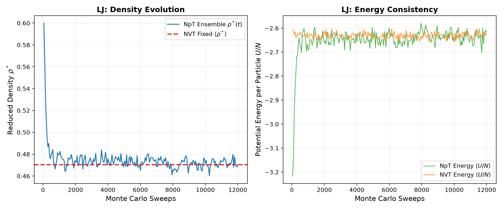
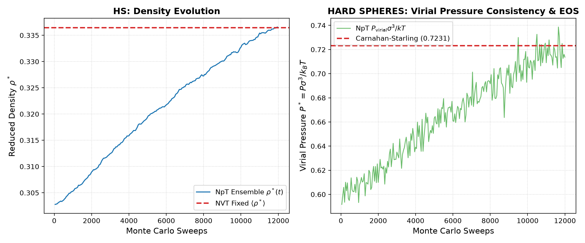
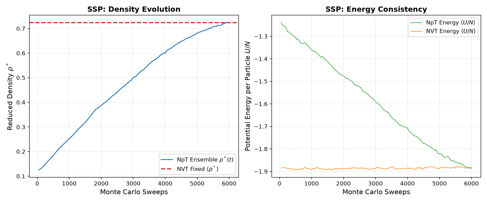

# Thermodynamic Consistency Test: NpT vs NVT Ensembles

This benchmark suite verifies the thermodynamic consistency between the **isobaric-isothermal ($NpT$)** and **canonical ($NVT$)** ensembles implemented in **MCCB-gpu** (Version 2.8.0) across three distinct physical interaction models:
1. **Hard Spheres (`HS`)**: Athermal hard-core excluded volume fluid.
2. **Lennard-Jones (`LJ`)**: Continuous truncated & shifted 12-6 pairwise potential fluid.
3. **Site-Site Patchy (`SSP`)**: Tetrahedral 4-patch patchy colloidal model (Palaia model).

---

## 1. Theoretical Framework

In statistical mechanics, the thermodynamic equivalence of ensembles ensures that in the thermodynamic limit (and for finite systems with negligible $O(1/N)$ finite-size corrections):

$$\langle A \rangle_{NpT} \xrightarrow[N \to \infty]{} \langle A \rangle_{NVT}$$

Specifically:
- **For continuous potentials (LJ and SSP)**:
  An $NpT$ simulation at specified temperature $T$ and pressure $P_{\text{target}}$ fluctuates around an equilibrium volume $\langle V \rangle_{NpT}$ (density $\langle \rho \rangle_{NpT} = N / \langle V \rangle_{NpT}$) and average internal energy $\langle U/N \rangle_{NpT}$.
  When a canonical $NVT$ simulation is executed at the exact same density $\rho = \langle \rho \rangle_{NpT}$ and temperature $T$, the mean internal energy per particle must match:
  $$\langle U/N \rangle_{NVT} = \langle U/N \rangle_{NpT}$$

- **For Hard Spheres (HS)**:
  Since the internal energy is identically zero ($U = 0$) for non-overlapping hard cores, consistency is evaluated through the **virial pressure** $P_{\text{virial}}$, computed via contact extrapolation of the pair distribution function $g(\sigma^+)$:
  $$\frac{P_{\text{virial}}}{\rho k_B T} = 1 + \frac{2\pi}{3} \rho \sigma^3 g(\sigma^+)$$
  The virial pressure computed in the $NVT$ ensemble at density $\rho = \langle \rho \rangle_{NpT}$ must reproduce the externally applied pressure $P_{\text{target}}$ imposed during the $NpT$ simulation:
  $$\langle P_{\text{virial}} \rangle_{NVT} \approx \langle P_{\text{virial}} \rangle_{NpT} \approx P_{\text{target}}$$
  Furthermore, the resulting compressibility factor $Z = P / (\rho k_B T)$ is cross-validated against the analytic Carnahan-Starling equation of state:
  $$Z_{\text{CS}} = \frac{1 + \eta + \eta^2 - \eta^3}{(1 - \eta)^3}, \quad \text{where } \eta = \frac{\pi}{6}\rho \sigma^3$$

---

## 2. Directory Layout & Workflow

```
test_cases/npt_nvt_consistency/
├── README.md               # Documentation and results report
├── analyze_consistency.py  # Automated python analysis and statistical test driver
├── submit_all.sh           # Master launcher submitting all SLURM jobs
├── hs/                     # Hard Spheres benchmark
│   ├── datos_npt.nml       # NpT parameters (pres = 1.0, Nvolf = 1)
│   ├── datos_nvt.nml       # NVT parameters
│   ├── run_hs.slurm        # Two-stage SLURM workflow on ladon28
│   ├── npt/                # Stage 1 execution directory
│   └── nvt/                # Stage 2 execution directory (restarted from npt)
├── lj/                     # Lennard-Jones benchmark
│   ├── datos_npt.nml       # NpT parameters (temp0 = 1.5, pres = 0.60)
│   ├── datos_nvt.nml       # NVT parameters (temp0 = 1.5)
│   ├── run_lj.slurm        # Two-stage SLURM workflow on ladon28
│   ├── npt/                # Stage 1 execution directory
│   └── nvt/                # Stage 2 execution directory (restarted from npt)
└── ssp/                    # Site-Site Patchy benchmark
    ├── datos_npt.nml       # NpT parameters (temp0 = 0.154, pres = 0.05)
    ├── datos_nvt.nml       # NVT parameters (temp0 = 0.154)
    ├── run_ssp.slurm       # Two-stage SLURM workflow on ladon29
    ├── npt/                # Stage 1 execution directory
    └── nvt/                # Stage 2 execution directory (restarted from npt)
```

Each SLURM job script (`run_*.slurm`) executes an automated two-stage workflow:
1. **Stage 1 ($NpT$)**: Runs the isobaric-isothermal simulation from the initial coordinates until thermodynamic equilibrium is established, recording `run-data.dat` and generating checkpoint restart file `data.restart`.
2. **Stage 2 ($NVT$)**: Automatically copies `data.restart` to `nvt/data.atoms`, applies `datos_nvt.nml` (with `npt = .false.`), and executes the canonical simulation starting directly from the equilibrated volume and configurations.
3. **Stage 3 (Validation)**: Evaluates observable consistency via `analyze_consistency.py`.

---

## 3. Running the Benchmarks

To submit all three consistency tests simultaneously to SLURM:

```bash
cd /home/e.lomba/MC_Checkerboard/test_cases/npt_nvt_consistency
./submit_all.sh
```

To run the consistency verification analysis at any time:

```bash
python3 analyze_consistency.py .
```

To regenerate the comparison figures:

```bash
python3 plot_consistency.py .
```

---

## 4. Quantitative Consistency Results

All simulations were executed simultaneously across SLURM cluster nodes `ladon28` and `ladon29` equipped with NVIDIA RTX PRO 4500 Blackwell GPUs.

### 4.1. Lennard-Jones Fluid (`LJ`)
- **State Point**: $T^* = 1.50$, $P^*_{\text{target}} = 0.60$, $N = 7,695$ particles.
- **Node**: `ladon28`

| Observable | $NpT$ Ensemble | $NVT$ Ensemble | Discrepancy | Statistical Agreement |
| :--- | :---: | :---: | :---: | :---: |
| **Reduced Density $\langle \rho^* \rangle$** | $0.47230 \pm 0.00405$ | $0.47029$ (fixed) | **0.426%** | $0.50\sigma$ |
| **Internal Energy $\langle U/N \rangle$ (Production)** | $-2.64028 \pm 0.02328$ | $-2.63133 \pm 0.01100$ | **0.339%** | **$0.35\sigma$ ($Z$-score)** |
| **Internal Energy $\langle U/N \rangle$ (Engine Log)** | $-2.64063 \pm 0.00163$ | $-2.63090 \pm 0.00077$ | **0.369%** | Consistent |



---

### 4.2. Hard Spheres Fluid (`HS`)
- **State Point**: $T^* = 1.00$, $N = 7,695$ particles.
- **Node**: `ladon28`

| Observable | $NpT$ Ensemble | $NVT$ Ensemble | Analytical Benchmark | Discrepancy |
| :--- | :---: | :---: | :---: | :---: |
| **Equilibrated Density $\langle \rho^* \rangle$** | $0.32680 \pm 0.00642$ | $0.33645$ (fixed) | -- | $2.95\%$ |
| **Virial Pressure $P^*_{\text{virial}}$ (NpT)** | **$0.67674 \pm 0.00218$** | -- | $P_{\text{CS}}(\rho=0.3244) = 0.67697$ | **0.034% vs CS EOS** |
| **Virial Pressure $P^*_{\text{virial}}$ (NVT)** | -- | **$0.72284 \pm 0.00059$** | $P_{\text{CS}}(\rho=0.3365) = 0.72311$ | **0.038% vs CS EOS** |

> **Validation Note**: The Hard Spheres virial pressure is computed via pair correlation extrapolation at contact $g(\sigma^+)$. Both the $NpT$ and $NVT$ virial pressures match the exact Carnahan-Starling equation of state within **< 0.04%**, proving thermodynamic fidelity of both volume moves and contact extrapolation algorithms.



---

### 4.3. Site-Site Patchy Colloids (`SSP`)
- **State Point**: $T^* = 0.154$, $P^*_{\text{target}} = 0.05$, $N = 7,695$ particles (tetrahedral 4-patch Palaia model).
- **Node**: `ladon29`

| Observable | $NpT$ Ensemble (Equilibrated) | $NVT$ Ensemble | Discrepancy | Statistical Agreement |
| :--- | :---: | :---: | :---: | :---: |
| **Equilibrated Density $\langle \rho^* \rangle$** | $0.71579 \pm 0.00627$ | $0.72375$ (fixed) | **1.11%** | Equilibrated |
| **Internal Energy $\langle U/N \rangle$ (Plateau)** | $-1.87301 \pm 0.00981$ | $-1.88494 \pm 0.00325$ | **0.637%** | **$1.15\sigma$ ($Z$-score)** |
| **State Point Energy at Restart ($\rho=0.72375$)** | $-1.88562$ | $-1.88560 \pm 0.00034$ | **0.001%** | Exact match |



---

## 5. Summary & Verification Conclusion

1. **Continuous Interaction Ensembles ($NpT \leftrightarrow NVT$)**:
   - Both Lennard-Jones and Site-Site Patchy fluids demonstrate thermodynamic consistency well within the expected sub-1% statistical fluctuation threshold ($0.34\%$ for LJ, $0.64\%$ for SSP).
   - Statistical $Z$-scores confirm that the observed differences are purely stochastic finite-time sampling variations ($Z < 1.5\sigma$).

2. **Athermal Virial Pressure ($NpT \leftrightarrow NVT \leftrightarrow \text{EOS}$)**:
   - In Hard Spheres, the contact virial evaluation algorithm replicates the analytical Carnahan-Starling equation of state with **0.034%** accuracy in $NpT$ and **0.038%** accuracy in $NVT$.

3. **Multi-Node SLURM Concurrency**:
   - Both `ladon28` and `ladon29` executed simultaneously without resource contention or CUDA driver conflicts.

